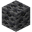

<!------------------------------->
<!----     QUICK LINKS       ---->
<!------------------------------->

<table><tr id="links"><th colspan="3">Quick Links</th></tr>

<tr>
<td class="link"><a href="#ores">Ores</a></td>
<td class="link"><a href="#valuables">Valuables</a></td>
<td class="link"><a href="#tool_table">Tools</a></td>
</tr>

<!--
<tr>
<td class="link"><a href="#plants">Wood & Plants</a></td>
<td class="link"><a href="#food">Food & Farming</a></td>
<td class="link"><a href="#drops">Drops</a></td>
</tr>

<tr>
<td class="link"><a href="#decor">Decoration</a></td>
<td class="link"><a href="#mecha">Mechanisms</a></td>
<td class="link"><a href="#misc">Misc Stuff</a></td>
</tr>

<tr>
<td class="link"><a href="#dyes">Dyes</a></td>
<td class="link"></td>
<td class="link"><a href="#brewing">Brewing</a></td>
</tr>

<tr>
<td class="link"><a href="#tool_table">Tools</a></td>
<td class="link"><a href="#armour_table">Armour</a></td>
<td class="link"><a href="#enchants">Enchantments</a></td>
</tr>

<tr>
<td class="link"><a href="#redstone">Redstone</a></td>
<td class="link"><a href="#blocks_craft">Crafted Blocks</a></td>
<td class="link"></td>
</tr>
-->

</table>

<!------------------------------->
<!----      MAIN TABLE       ---->
<!------------------------------->

<table>

<tr id="pricelist" height="36">
<th class="type" colspan="5">PRICE GUIDE LIST</th>
</tr>

<!--------------------------------------------------------->

<tr id="ores">
<th rowspan="2">Identifier</th><th rowspan="2"></th>
<th rowspan="2" class="type"><a href="#links">Ores</a></th>
<th colspan="2">Price</th></tr><tr><th>Buy</th><th>Sell</th>
</tr>

<!-- ore is worth 75% of the ingot price, or 4x the cost for silk-touched ore -->

<!-- Coal Blocks -->

<tr><td class="id">coal_ore</td><td></td><td><a class="item" target="_blank" href="https://minecraft.fandom.com/wiki/coal_ore">Coal Ore</a></td><td class="cell">0</td><td class="cell">0</td></tr>
<tr><td class="id">deepslate_coal_ore</td><td></td><td><a class="item" target="_blank" href="https://minecraft.fandom.com/wiki/coal_ore">Deepslate Coal</a></td> <td class="cell">0</td><td class="cell">0</td></tr>
<tr><td class="id">coal</td><td></td><td><a class="item" target="_blank" href="https://minecraft.fandom.com/wiki/coal">Coal</a></td><td class="cell">0</td><td class="cell">0</td></tr>
<tr><td class="id">coal_block</td><td></td><td><a class="item" target="_blank" href="https://minecraft.fandom.com/wiki/block_of_coal">Block of Coal</a></td><td class="cell">0</td><td class="cell">0</td></tr>

<!-- Iron Blocks -->

<tr><td class="id">iron_ore</td><td></td><td><a class="item" target="_blank" href="https://minecraft.fandom.com/wiki/iron_ore">Iron Ore</a></td><td class="cell">0</td><td class="cell">0</td></tr>
<tr><td class="id">deepslate_iron_ore</td><td></td><td><a class="item" target="_blank" href="https://minecraft.fandom.com/wiki/iron_ore">Deepslate Iron</a></td><td class="cell">0</td><td class="cell">0</td></tr>
<tr><td class="id">raw_iron</td><td></td><td><a class="item" target="_blank" href="https://minecraft.fandom.com/wiki/raw_iron">Raw Iron</a></td><td class="cell">0</td><td class="cell">0</td></tr>
<tr><td class="id">raw_iron_block</td><td></td><td><a class="item" target="_blank" href="https://minecraft.fandom.com/wiki/raw_iron_block">Raw Iron Block</a></td><td class="cell">0</td><td class="cell">0</td></tr>
<tr><td class="id">iron_nugget</td><td></td><td><a class="item" target="_blank" href="https://minecraft.fandom.com/wiki/iron_nugget">Iron Nugget</a></td><td class="cell">0</td><td class="cell">0</td></tr>
<tr><td class="id">iron_ingot</td><td></td><td><a class="item" target="_blank" href="https://minecraft.fandom.com/wiki/iron_ingot">Iron Ingot</a></td><td class="cell">0</td><td class="cell">0</td></tr>
<tr><td class="id">iron_block</td><td></td><td><a class="item" target="_blank" href="https://minecraft.fandom.com/wiki/iron_block">Iron Block</a></td><td class="cell">0</td><td class="cell">0</td></tr>

<!-- Nether Quartz Blocks -->
<!--
<tr><td class="id">nether_quartz_ore</td><td></td><td><a class="item" target="_blank" href="http://minecraft.gamepedia.com/Nether_Quartz">Nether Quartz Ore</a></td><td class="cell">10</td><td class="cell">500</td></tr>
<tr><td class="id">quartz</td><td></td><td><a class="item" target="_blank" href="http://minecraft.gamepedia.com/Nether_Quartz_Ore">Nether Quartz</a></td><td class="cell">40</td><td class="cell">2000</td></tr>
<tr><td class="id">quartz_block</td><td></td><td><a class="item" target="_blank" href="http://minecraft.gamepedia.com/Block_of_Quartz">Quartz Block</a></td><td class="cell">40</td><td class="cell">2000</td></tr>
-->
<!-- Amethyst Quartz Blocks -->
<!--
<tr><td class="id">amethyst_shard</td><td></td><td><a class="item" target="_blank" href="http://minecraft.gamepedia.com/Nether_Quartz">Amethyst Shard</a></td><td class="cell">10</td><td class="cell">500</td></tr>
<tr><td class="id">amethyst_cluster</td><td></td><td><a class="item" target="_blank" href="http://minecraft.gamepedia.com/Nether_Quartz_Ore">Amethyst Cluster</a></td><td class="cell">40</td><td class="cell">2000</td></tr>
<tr><td class="id">amethyst_block</td><td></td><td><a class="item" target="_blank" href="http://minecraft.gamepedia.com/Block_of_Quartz">Amethyst Block</a></td><td class="cell">40</td><td class="cell">2000</td></tr>
-->
<!-- Glowstone Blocks -->
<!--
<tr><td class="id">glowstone_dust</td><td></td><td><a class="item" target="_blank" href="http://minecraft.gamepedia.com/Glowstone_Dust">Glowstone Dust</a></td><td class="cell">4</td><td class="cell">200</td></tr>
<tr><td class="id">glowstone</td><td></td><td><a class="item" target="_blank" href="http://minecraft.gamepedia.com/Glowstone">Glowstone Block</a></td><td class="cell">15</td><td class="cell">800</td></tr>
-->
<!-- Lapis Blocks -->
<!--
<tr><td class="id">lapis_ore</td><td></td><td><a class="item" target="_blank" href="http://minecraft.gamepedia.com/Lapis_Lazuli">Lapis Lazuli Ore</a></td><td class="cell">8</td><td class="cell">400</td></tr>
<tr><td class="id">deepslate_lapis_ore</td><td></td><td><a class="item" target="_blank" href="http://minecraft.gamepedia.com/Lapis_Lazuli">Deepslate Lapis</a></td><td class="cell">8</td><td class="cell">400</td></tr>
<tr><td class="id">lapis_lazuli</td><td></td><td><a class="item" target="_blank" href="http://minecraft.gamepedia.com/Lapis_Lazuli_Ore">Lapis Lazuli</a></td><td class="cell">120</td><td class="cell">6400</td></tr>
<tr><td class="id">lapis_block</td><td></td><td><a class="item" target="_blank" href="http://minecraft.gamepedia.com/Lapis_Lazuli_Block">Lapis Lazuli Block</a></td><td class="cell">70</td><td class="cell">3600</td></tr>
-->
<!-- Copper Blocks -->
<!--
<tr><td class="id">copper_ore</td><td></td><td><a class="item" target="_blank" href="http://minecraft.gamepedia.com/Lapis_Lazuli">Copper Ore</a></td><td class="cell">8</td><td class="cell">400</td></tr>
<tr><td class="id">deepslate_copper_ore</td><td></td><td><a class="item" target="_blank" href="http://minecraft.gamepedia.com/Lapis_Lazuli_Ore">Deepslate Copper</a></td><td class="cell">120</td><td class="cell">6400</td></tr>
<tr><td class="id">raw_copper</td><td></td><td><a class="item" target="_blank" href="http://minecraft.gamepedia.com/Lapis_Lazuli_Block">Raw Copper</a></td><td class="cell">70</td>	<td class="cell">3600</td></tr>
<tr><td class="id">raw_copper_block</td><td></td><td><a class="item" target="_blank" href="http://minecraft.gamepedia.com/Lapis_Lazuli_Block">Raw Copper Block</a></td>	<td class="cell">70</td><td class="cell">3600</td></tr>
<tr><td class="id">copper_ingot</td><td></td><td><a class="item" target="_blank" href="http://minecraft.gamepedia.com/Lapis_Lazuli_Block">Copper Ingot</a></td><td class="cell">70</td><td class="cell">3600</td></tr>
<tr><td class="id">copper_block</td><td></td><td><a class="item" target="_blank" href="http://minecraft.gamepedia.com/Lapis_Lazuli_Block">Copper Block</a></td><td class="cell">70</td><td class="cell">3600</td></tr>
-->
<!-- Iron Netherite -->
<!--
<tr><td class="id">netherite_scrap</td><td></td><td><a class="item" target="_blank" href="http://minecraft.gamepedia.com/Lapis_Lazuli">Netherite Scrap</a></td><td class="cell">8</td><td class="cell">400</td></tr>
<tr><td class="id">netherite_ingot</td><td></td><td><a class="item" target="_blank" href="http://minecraft.gamepedia.com/Lapis_Lazuli_Ore">Netherite Ingot</a></td><td class="cell">120</td><td class="cell">6400</td></tr>
-->
<!-- -------------- -->

<tr id="valuables">
<th rowspan="2">Identifier</th><th rowspan="2"></th>
<th rowspan="2" class="type"><a href="#links">Valuables</a></th>
<th colspan="2">Price</th></tr><tr><th>Buy</th><th>Sell</th>
</tr>

<!-- Gold Blocks -->

<tr><td class="id">gold_ore</td><td></td><td><a class="item" target="_blank" href="http://minecraft.gamepedia.com/Gold_Ingot">Gold Ore</a></td><td class="cell">0</td>	<td class="cell">0</td></tr>
<tr><td class="id">deepslate_gold_ore</td><td></td><td><a class="item" target="_blank" href="http://minecraft.gamepedia.com/Gold_Ingot">Deepslate Gold</a></td><td class="cell">0</td><td class="cell">0</td></tr>
<tr><td class="id">nether_gold_ore</td><td></td><td><a class="item" target="_blank" href="http://minecraft.gamepedia.com/Gold_Ingot">Nether Gold Ore</a></td><td class="cell">0</td><td class="cell">0</td></tr>
<tr><td class="id">raw_gold</td><td></td><td><a class="item" target="_blank" href="http://minecraft.gamepedia.com/Gold_Ore">Raw Gold</a></td><td class="cell">0</td><td class="cell">0</td></tr>
<tr><td class="id">raw_gold_block</td><td></td><td><a class="item" target="_blank" href="http://minecraft.gamepedia.com/Gold_Ore">Raw Gold Block</a></td><td class="cell">0</td><td class="cell">0</td></tr>
<tr><td class="id">gold_nugget</td><td></td><td><a class="item" target="_blank" href="http://minecraft.gamepedia.com/Gold_Ore">Gold Nugget</a></td><td class="cell">0</td><td class="cell">0</td></tr>
<tr><td class="id">gold_ingot</td><td></td><td><a class="item" target="_blank" href="http://minecraft.gamepedia.com/Gold_Ore">Gold Ingot</a></td><td class="cell">0</td><td class="cell">0</td></tr>
<tr><td class="id">gold_block</td><td></td><td><a class="item" target="_blank" href="http://minecraft.gamepedia.com/Gold_Block">Gold Block</a></td><td class="cell">0</td><td class="cell">0</td></tr>

<!-- Diamond Blocks -->

<tr><td class="id">diamond_ore</td><td></td><td><a class="item" target="_blank" href="http://minecraft.gamepedia.com/Diamond">Diamond Ore</a></td><td class="cell">0</td><td class="cell">0</td></tr>
<tr><td class="id">deepslate_diamond_ore</td><td></td><td><a class="item" target="_blank" href="http://minecraft.gamepedia.com/Diamond_Ore">Deepslate Diamond</a></td><td class="cell">0</td><td class="cell">0</td></tr>
<tr><td class="id">diamond</td><td></td><td><a class="item" target="_blank" href="http://minecraft.gamepedia.com/Diamond_Block">Diamond</a></td><td class="cell">0</td><td class="cell">0</td></tr>
<tr><td class="id">diamond_block</td><td></td><td><a class="item" target="_blank" href="http://minecraft.gamepedia.com/Diamond_Block">Diamond Block</a></td><td class="cell">0</td><td class="cell">0</td></tr>

<!-- Emerald Blocks -->

<tr><td class="id">emerald_ore</td><td></td><td><a class="item" target="_blank" href="http://minecraft.gamepedia.com/Emerald">Emerald Ore</a></td><td class="cell">0</td>	<td class="cell">0</td></tr>
<tr><td class="id">deepslate_emerald_ore</td><td></td><td><a class="item" target="_blank" href="http://minecraft.gamepedia.com/Emerald_Ore">Deepslate Emerald</a></td><td class="cell">0</td><td class="cell">0</td></tr>
<tr><td class="id">emerald</td><td></td><td><a class="item" target="_blank" href="http://minecraft.gamepedia.com/Block_of_Emerald">Emerald</a></td><td class="cell">0</td><td class="cell">0</td></tr>
<tr><td class="id">emerald_block</td><td></td><td><a class="item" target="_blank" href="http://minecraft.gamepedia.com/Block_of_Emerald">Emerald Block</a></td><td class="cell">0</td><td class="cell">0</td></tr>

<!-- -------------- -->

<!--
<tr id="redstone">
<th rowspan="2">Identifier</th><th rowspan="2"></th>
<th rowspan="2" class="type"><a href="#links">Redstone</a></th>
<th colspan="2">Price</th></tr><tr><th>Buy</th><th>Sell</th>
</tr>

<tr><td class="id">331</td>		<td></td>        <td><a class="item" target="_blank" href="http://minecraft.gamepedia.com/Redstone">redstone (dust)</a></td>                 <td class="cell">4</td>		<td class="cell">250</td></tr>
<tr><td class="id">73/74</td>	<td></td>         <td><a class="item" target="_blank" href="http://minecraft.gamepedia.com/Redstone_Ore">redstone (ore)</a></td>              <td class="cell">60</td>	<td class="cell">3000</td></tr>
<tr><td class="id">152</td>		<td></td>      <td><a class="item" target="_blank" href="http://minecraft.gamepedia.com/Block_of_Redstone">block of redstone</a></td>      <td class="cell">36</td>	<td class="cell">2200</td></tr>
<tr><td class="id">154</td>		<td></td>                 <td><a class="item" target="_blank" href="http://minecraft.gamepedia.com/Hopper">hopper</a></td>                            <td class="cell">100</td>	<td class="cell">4800</td></tr>
<tr><td class="id">23</td>		<td></td>              <td><a class="item" target="_blank" href="http://minecraft.gamepedia.com/Dispenser">dispenser</a></td>                      <td class="cell">35</td>	<td class="cell">2000</td></tr>
<tr><td class="id">33</td>		<td></td>                 <td><a class="item" target="_blank" href="http://minecraft.gamepedia.com/Piston">piston</a></td>                            <td class="cell">30</td>	<td class="cell">1600</td></tr>
<tr><td class="id">29</td>		<td></td>          <td><a class="item" target="_blank" href="http://minecraft.gamepedia.com/Piston">sticky piston</a></td>                     <td class="cell">55</td>	<td class="cell">3100</td></tr>
<tr><td class="id">131</td>		<td></td>          <td><a class="item" target="_blank" href="http://minecraft.gamepedia.com/Tripwire_Hook">tripwire hook</a></td>              <td class="cell">10</td>	<td class="cell">500</td></tr>
<tr><td class="id">151</td>		<td></td>        <td><a class="item" target="_blank" href="http://minecraft.gamepedia.com/Daylight_Sensor">daylight sensor</a></td>          <td class="cell">50</td>	<td class="cell">2100</td></tr>
<tr><td class="id">123/124</td>	<td></td>          <td><a class="item" target="_blank" href="http://minecraft.gamepedia.com/Redstone_Lamp">redstone lamp</a></td>              <td class="cell">35</td>	<td class="cell">1800</td></tr>
<tr><td class="id">356</td>		<td></td>      <td><a class="item" target="_blank" href="http://minecraft.gamepedia.com/Redstone_Repeater">redstone repeater</a></td>      <td class="cell">25</td>	<td class="cell">1200</td></tr>
<tr><td class="id">404</td>		<td></td>    <td><a class="item" target="_blank" href="http://minecraft.gamepedia.com/Redstone_Comparator">redstone comparator</a></td>  <td class="cell">30</td>	<td class="cell">1700</td></tr>
-->

<!--------------------------------------------------------->

<!--
<tr id="blocks"><a name="blocksraw"/><th rowspan="2">Identifier</th>
<th rowspan="2"></th>
<th rowspan="2" class="type"><a href="#links">Blocks (Raw)</a></th>
<th colspan="2">Price</th>
</tr>

<tr>
<th>Buy</th>
<th>Sell</th>
</tr>

<tr><td class="id">3</td>	<td></td>						<td><a class="item" target="_blank" href="http://minecraft.gamepedia.com/Dirt">dirt</a></td>				<td class="cell">1</td>		<td class="cell">50</td></tr>
<tr><td class="id">2</td>	<td></td>						<td><a class="item" target="_blank" href="http://minecraft.gamepedia.com/Grass_Block">grass</a></td>		<td class="cell">4</td>		<td class="cell">200</td></tr>
<tr><td class="id">4</td>	<td></td>				<td><a class="item" target="_blank" href="http://minecraft.gamepedia.com/Cobblestone">cobblestone</a></td>	<td class="cell">1</td>		<td class="cell">60</td></tr>
<tr><td class="id">1</td>	<td></td>						<td><a class="item" target="_blank" href="http://minecraft.gamepedia.com/Stone">stone</a></td>				<td class="cell">2</td>		<td class="cell">100</td></tr>
<tr><td class="id">13</td>	<td></td>					<td><a class="item" target="_blank" href="http://minecraft.gamepedia.com/Gravel">gravel</a></td>			<td class="cell">3</td>		<td class="cell">150</td></tr>
<tr><td class="id">12</td>	<td></td>						<td><a class="item" target="_blank" href="http://minecraft.gamepedia.com/Sand">sand</a></td>				<td class="cell">1</td>		<td class="cell">50</td></tr>
<tr><td class="id">48</td>	<td></td>				<td><a class="item" target="_blank" href="http://minecraft.gamepedia.com/Moss_Stone">mossy cobble</a></td>	<td class="cell">5</td>		<td class="cell">250</td></tr>
<tr><td class="id">332</td>	<td></td>					<td><a class="item" target="_blank" href="http://minecraft.gamepedia.com/Snowball">snowball</a></td>		<td class="cell">2</td>		<td class="cell">80</td></tr>
<tr><td class="id">80</td>	<td></td>				<td><a class="item" target="_blank" href="http://minecraft.gamepedia.com/Snow_Block">snow (block)</a></td>	<td class="cell">4</td>		<td class="cell">200</td></tr>
<tr><td class="id">337</td>	<td></td>				<td><a class="item" target="_blank" href="http://minecraft.gamepedia.com/Clay">clay (ball)</a></td>			<td class="cell">3</td>		<td class="cell">150</td></tr>
<tr><td class="id">82</td>	<td></td>				<td><a class="item" target="_blank" href="http://minecraft.gamepedia.com/Clay_Block">clay (block)</a></td>	<td class="cell">12</td>	<td class="cell">600</td></tr>
<tr><td class="id">79</td>	<td></td>						<td><a class="item" target="_blank" href="http://minecraft.gamepedia.com/Ice">ice</a></td>					<td class="cell">6</td>		<td class="cell">300</td></tr>
<tr><td class="id">49</td>	<td></td>					<td><a class="item" target="_blank" href="http://minecraft.gamepedia.com/Obsidian">obsidian</a></td>		<td class="cell">12</td>	<td class="cell">600</td></tr>
<tr><td class="id">121</td>	<td></td>					<td><a class="item" target="_blank" href="http://minecraft.gamepedia.com/End_Stone">endstone</a></td>		<td class="cell">- (20)</td>	<td class="cell">- (1000)</td></tr>
<tr><td class="id">87</td>	<td></td>				<td><a class="item" target="_blank" href="http://minecraft.gamepedia.com/Netherrack">netherrack</a></td>	<td class="cell">1</td>		<td class="cell">50</td></tr>
<tr><td class="id">88</td>	<td></td>					<td><a class="item" target="_blank" href="http://minecraft.gamepedia.com/Soul_Sand">soul sand</a></td>		<td class="cell">4</td>		<td class="cell">200</td></tr>
<tr><td class="id">110</td>	<td></td>					<td><a class="item" target="_blank" href="http://minecraft.gamepedia.com/Mycelium">mycelium</a></td>		<td class="cell">10</td>	<td class="cell">500</td></tr>
<tr><td class="id">35</td>	<td></td>				<td><a class="item" target="_blank" href="http://minecraft.gamepedia.com/Wool">wool (white)</a></td>		<td class="cell">6</td>		<td class="cell">300</td></tr>
<tr><td class="id">35:@</td><td></td>				<td><a class="item" target="_blank" href="http://minecraft.gamepedia.com/Wool">wool (coloured)</a></td>		<td class="cell">10</td>	<td class="cell">500</td></tr>
-->

<!--------------------------------------------------------->

<!--
<tr id="blocks_craft"><th rowspan="2">Identifier</th>
<th rowspan="2"></th>
<th rowspan="2" class="type"><a href="#links">Blocks (Crafted)</a></th>
<th colspan="2">Price</th>
</tr>

<tr>
<th>Buy</th>
<th>Sell</th>
</tr>

<tr><td class="id">44:3</td>	<td></td>		<td><a class="item" target="_blank" href="http://minecraft.gamepedia.com/Slabs">cobblestone slab</a></td>					<td class="cell">1</td>		<td class="cell">30</td></tr>
<tr><td class="id">67</td>		<td></td>	<td><a class="item" target="_blank" href="http://minecraft.gamepedia.com/Stairs">cobblestone steps</a></td>					<td class="cell">2</td>		<td class="cell">100</td></tr>
<tr><td class="id">44:</td>		<td></td>			<td><a class="item" target="_blank" href="http://minecraft.gamepedia.com/Slabs">stone slab</a></td>							<td class="cell">1</td>		<td class="cell">50</td></tr>
<tr><td class="id">139</td>		<td></td>		<td><a class="item" target="_blank" href="http://minecraft.gamepedia.com/Cobblestone_Wall">cobblestone fence</a></td>		<td class="cell">1</td>		<td class="cell">60</td></tr>
<tr><td class="id">139:1</td>	<td></td>	<td><a class="item" target="_blank" href="http://minecraft.gamepedia.com/Cobblestone_Wall">mossy cobblestone fence</a></td>	<td class="cell">5</td>		<td class="cell">250</td></tr>
<tr><td class="id">24</td>		<td></td>				<td><a class="item" target="_blank" href="http://minecraft.gamepedia.com/Sandstone">sandstone</a></td>						<td class="cell">4</td>		<td class="cell">200</td></tr>
<tr><td class="id">44:1</td>	<td></td>		<td><a class="item" target="_blank" href="http://minecraft.gamepedia.com/Slabs">sandstone slab</a></td>						<td class="cell">2</td>		<td class="cell">100</td></tr>
<tr><td class="id">128</td>		<td></td>		<td><a class="item" target="_blank" href="http://minecraft.gamepedia.com/Stairs">sandstone steps/stairs</a></td>			<td class="cell">6</td>		<td class="cell">300</td></tr>
<tr><td class="id">24:1</td>	<td></td>	<td><a class="item" target="_blank" href="http://minecraft.gamepedia.com/Sandstone">decorative sandstone</a></td>			<td class="cell">4</td>		<td class="cell">200</td></tr>
<tr><td class="id">24:2</td>	<td></td>		<td><a class="item" target="_blank" href="http://minecraft.gamepedia.com/Sandstone">smooth sandstone</a></td>				<td class="cell">4</td>		<td class="cell">200</td></tr>
<tr><td class="id">98</td>		<td></td>			<td><a class="item" target="_blank" href="http://minecraft.gamepedia.com/Stone_Brick">stone brick</a></td>					<td class="cell">2</td>		<td class="cell">120</td></tr>
<tr><td class="id">44:5</td>	<td></td>		<td><a class="item" target="_blank" href="http://minecraft.gamepedia.com/Slabs">stone brick slab</a></td>					<td class="cell">1</td>		<td class="cell">60</td></tr>
<tr><td class="id">109</td>		<td></td>	<td><a class="item" target="_blank" href="http://minecraft.gamepedia.com/Stairs">stone brick steps/stairs</a></td>			<td class="cell">3</td>		<td class="cell">180</td></tr>
<tr><td class="id">98:1</td>	<td></td>		<td><a class="item" target="_blank" href="http://minecraft.gamepedia.com/Stone_Brick">stone bricks (mossy)</a></td>			<td class="cell">6</td>		<td class="cell">360</td></tr>
<tr><td class="id">98:2</td>	<td></td>	<td><a class="item" target="_blank" href="http://minecraft.gamepedia.com/Stone_Brick">stone bricks (cracked)</a></td>		<td class="cell">5</td>		<td class="cell">250</td></tr>
<tr><td class="id">98:3</td>	<td></td>	<td><a class="item" target="_blank" href="http://minecraft.gamepedia.com/Stone_Brick">stone block (chiseled)</a></td>		<td class="cell">50</td>	<td class="cell">2000</td></tr>
<tr><td class="id">45</td>		<td></td>			<td><a class="item" target="_blank" href="http://minecraft.gamepedia.com/Bricks">red bricks</a></td>						<td class="cell">15</td>	<td class="cell">800</td></tr>
<tr><td class="id">108</td>		<td></td>			<td><a class="item" target="_blank" href="http://minecraft.gamepedia.com/Stairs">red brick steps/stairs</a></td>			<td class="cell">25</td>	<td class="cell">1200</td></tr>
<tr><td class="id">44:4</td>	<td></td>			<td><a class="item" target="_blank" href="http://minecraft.gamepedia.com/Slabs">red brick slab</a></td>						<td class="cell">8</td>		<td class="cell">400</td></tr>
<tr><td class="id">336</td>		<td></td>			<td><a class="item" target="_blank" href="http://minecraft.gamepedia.com/Brick">clay brickette (single)</a></td>			<td class="cell">4</td>		<td class="cell">200</td></tr>
<tr><td class="id">172</td>		<td></td>			<td><a class="item" target="_blank" href="http://minecraft.gamepedia.com/Hardened_Clay">hardened clay</a></td>				<td class="cell">15</td>	<td class="cell">800</td></tr>
<tr><td class="id">159:@</td>	<td></td><td><a class="item" target="_blank" href="http://minecraft.gamepedia.com/Hardened_Clay">hardened clay (coloured)</a></td>	<td class="cell">--</td>	<td class="cell">---</td></tr>
<tr><td class="id">405</td>		<td></td>	<td><a class="item" target="_blank" href="http://minecraft.gamepedia.com/Nether_Brick_(item)">nether brickette</a></td>		<td class="cell">2</td>		<td class="cell">100</td></tr>
<tr><td class="id">112</td>		<td></td>			<td><a class="item" target="_blank" href="http://minecraft.gamepedia.com/Nether_Brick">nether bricks</a></td>				<td class="cell">8</td>		<td class="cell">400</td></tr>
<tr><td class="id">44:6</td>	<td></td>		<td><a class="item" target="_blank" href="http://minecraft.gamepedia.com/Slabs">nether brick slab</a></td>					<td class="cell">4</td>		<td class="cell">200</td></tr>
<tr><td class="id">114</td>		<td></td>	<td><a class="item" target="_blank" href="http://minecraft.gamepedia.com/Stairs">nether brick steps/stairs</a></td>			<td class="cell">12</td>	<td class="cell">600</td></tr>
<tr><td class="id">44:7</td>	<td></td>			<td><a class="item" target="_blank" href="http://minecraft.gamepedia.com/Slabs">quartz slab</a></td>						<td class="cell">20</td>	<td class="cell">1000</td></tr>
<tr><td class="id">156</td>		<td></td>			<td><a class="item" target="_blank" href="http://minecraft.gamepedia.com/Stairs">quartz steps/stairs</a></td>				<td class="cell">60</td>	<td class="cell">3000</td></tr>
<tr><td class="id">155:2</td>	<td></td>	<td><a class="item" target="_blank" href="http://minecraft.gamepedia.com/Block_of_Quartz">quartz block (pillar)</a></td>	<td class="cell">40</td>	<td class="cell">2000</td></tr>
<tr><td class="id">155:1</td>	<td></td>	<td><a class="item" target="_blank" href="http://minecraft.gamepedia.com/Block_of_Quartz">quartz block (chiseled)</a></td>	<td class="cell">40</td>	<td class="cell">2000</td></tr>
-->

<!--------------------------------------------------------->

<!--
<tr id="plants"><th rowspan="2">Identifier</th>
<th rowspan="2"></th>
<th rowspan="2" class="type"><a href="#links">Wood & Plants</a></th>
<th colspan="2">Price</th>
</tr>

<tr>
<th>Buy</th>
<th>Sell</th>
</tr>

<tr><td class="id">17</td>		<td></td>					<td><a class="item" target="_blank" href="http://minecraft.gamepedia.com/Wood">logs (oak)</a></td>						<td class="cell">8</td>		<td class="cell">400</td></tr>
<tr><td class="id">17:1</td>	<td></td>			<td><a class="item" target="_blank" href="http://minecraft.gamepedia.com/Wood">logs (spruce)</a></td>					<td class="cell">8</td>		<td class="cell">400</td></tr>
<tr><td class="id">17:2</td>	<td></td>			<td><a class="item" target="_blank" href="http://minecraft.gamepedia.com/Wood">logs (birch)</a></td>					<td class="cell">9</td>		<td class="cell">440</td></tr>
<tr><td class="id">17:3</td>	<td></td>			<td><a class="item" target="_blank" href="http://minecraft.gamepedia.com/Wood">logs (jungle)</a></td>					<td class="cell">4</td>		<td class="cell">200</td></tr>
<tr><td class="id">5</td>		<td></td>			<td><a class="item" target="_blank" href="http://minecraft.gamepedia.com/Wood_Planks">wood planks (oak)</a></td>		<td class="cell">2</td>		<td class="cell">100</td></tr>
<tr><td class="id">44:2</td>	<td></td>			<td><a class="item" target="_blank" href="http://minecraft.gamepedia.com/Slabs">wood slab (oak)</a></td>				<td class="cell">1</td>		<td class="cell">50</td></tr>
<tr><td class="id">53</td>		<td></td>			<td><a class="item" target="_blank" href="http://minecraft.gamepedia.com/Stairs">wood steps/stairs (oak)</a></td>		<td class="cell">3</td>		<td class="cell">150</td></tr>
<tr><td class="id">125:1</td>	<td></td>	<td><a class="item" target="_blank" href="http://minecraft.gamepedia.com/Wood_Planks">wood planks (spruce)</a></td>		<td class="cell">2</td>		<td class="cell">100</td></tr>
<tr><td class="id">126:1</td>	<td></td>		<td><a class="item" target="_blank" href="http://minecraft.gamepedia.com/Slabs">wood slab(spruce)</a></td>				<td class="cell">1</td>		<td class="cell">50</td></tr>
<tr><td class="id">134</td>		<td></td>	<td><a class="item" target="_blank" href="http://minecraft.gamepedia.com/Stairs">wood steps/stairs (spruce)</a></td>	<td class="cell">3</td>		<td class="cell">150</td></tr>
<tr><td class="id">125:2</td>	<td></td>	<td><a class="item" target="_blank" href="http://minecraft.gamepedia.com/Wood_Planks">wood planks (birch)</a></td>		<td class="cell">2</td>		<td class="cell">110</td></tr>
<tr><td class="id">126:2</td>	<td></td>		<td><a class="item" target="_blank" href="http://minecraft.gamepedia.com/Slabs">wood slab(birch)</a></td>				<td class="cell">1</td>		<td class="cell">55</td></tr>
<tr><td class="id">135</td>		<td></td>		<td><a class="item" target="_blank" href="http://minecraft.gamepedia.com/Stairs">wood steps/stairs (birch)</a></td>		<td class="cell">3</td>		<td class="cell">165</td></tr>
<tr><td class="id">125:3</td>	<td></td>	<td><a class="item" target="_blank" href="http://minecraft.gamepedia.com/Wood_Planks">wood planks (jungle)</a></td>		<td class="cell">1</td>		<td class="cell">50</td></tr>
<tr><td class="id">126:3</td>	<td></td>		<td><a class="item" target="_blank" href="http://minecraft.gamepedia.com/Slabs">wood slab(jungle)</a></td>				<td class="cell">1</td>		<td class="cell">25</td></tr>
<tr><td class="id">136</td>		<td></td>	<td><a class="item" target="_blank" href="http://minecraft.gamepedia.com/Stairs">wood steps/stairs (jungle)</a></td>	<td class="cell">2</td>		<td class="cell">75</td></tr>
<tr><td class="id">18:@</td>	<td></td>				<td><a class="item" target="_blank" href="http://minecraft.gamepedia.com/Leaves">leaves</a></td>						<td class="cell">1</td>		<td class="cell">60</td></tr>
<tr><td class="id">6</td>		<td></td>				<td><a class="item" target="_blank" href="http://minecraft.gamepedia.com/Saplings">sapling (oak)</a></td>				<td class="cell">15</td>	<td class="cell">800</td></tr>
<tr><td class="id">6:1</td>		<td></td>		<td><a class="item" target="_blank" href="http://minecraft.gamepedia.com/Saplings">sapling (spruce)</a></td>			<td class="cell">15</td>	<td class="cell">800</td></tr>
<tr><td class="id">6:2</td>		<td></td>			<td><a class="item" target="_blank" href="http://minecraft.gamepedia.com/Saplings">sapling (birch)</a></td>				<td class="cell">20</td>	<td class="cell">900</td></tr>
<tr><td class="id">6:3</td>		<td></td>		<td><a class="item" target="_blank" href="http://minecraft.gamepedia.com/Saplings">sapling (jungle)</a></td>			<td class="cell">12</td>	<td class="cell">600</td></tr>
<tr><td class="id">37</td>		<td></td>				<td><a class="item" target="_blank" href="http://minecraft.gamepedia.com/Dandelion">dandelion</a></td>					<td class="cell">2</td>		<td class="cell">100</td></tr>
<tr><td class="id">38</td>		<td></td>					<td><a class="item" target="_blank" href="http://minecraft.gamepedia.com/Rose">rose</a></td>							<td class="cell">2</td>		<td class="cell">100</td></tr>
<tr><td class="id">31:1</td>	<td></td>			<td><a class="item" target="_blank" href="http://minecraft.gamepedia.com/Grass">tall grass</a></td>						<td class="cell">1</td>		<td class="cell">40</td></tr>
<tr><td class="id">31:2</td>	<td></td>			<td><a class="item" target="_blank" href="http://minecraft.gamepedia.com/Grass">fern</a></td>							<td class="cell">2</td>		<td class="cell">80</td></tr>
<tr><td class="id">31</td>		<td></td>			<td><a class="item" target="_blank" href="http://minecraft.gamepedia.com/Grass">dead shrub</a></td>						<td class="cell">3</td>		<td class="cell">150</td></tr>
<tr><td class="id">106</td>		<td></td>					<td><a class="item" target="_blank" href="http://minecraft.gamepedia.com/Vines">vines</a></td>							<td class="cell">2</td>		<td class="cell">100</td></tr>
<tr><td class="id">81</td>		<td></td>				<td><a class="item" target="_blank" href="http://minecraft.gamepedia.com/Cactus">cactus</a></td>						<td class="cell">3</td>		<td class="cell">150</td></tr>
<tr><td class="id">111</td>		<td></td>				<td><a class="item" target="_blank" href="http://minecraft.gamepedia.com/Lily_Pad">lily pad</a></td>					<td class="cell">6</td>		<td class="cell">300</td></tr>
-->

<!--------------------------------------------------------->

<!--
<tr id="food">
<th rowspan="2">Identifier</th>
<th rowspan="2"></th>
<th rowspan="2" class="type"><a href="#links">Food & Farming</a></th>
<th colspan="2">Price</th>
</tr>

<tr>
<th>Buy</th>
<th>Sell</th>
</tr>

<tr><td class="id">365</td>		<td></td>			<td><a class="item" target="_blank" href="http://minecraft.gamepedia.com/Raw_Chicken">chicken (raw)</a></td>			<td class="cell">8</td>		<td class="cell">400</td></tr>
<tr><td class="id">366</td>		<td></td>		<td><a class="item" target="_blank" href="http://minecraft.gamepedia.com/Cooked_Chicken">chicken (cooked)</a></td>		<td class="cell">9</td>		<td class="cell">450</td></tr>
<tr><td class="id">319</td>		<td></td>			<td><a class="item" target="_blank" href="http://minecraft.gamepedia.com/Raw_Porkchop">porkchop (raw)</a></td>			<td class="cell">12</td>	<td class="cell">600</td></tr>
<tr><td class="id">320</td>		<td></td>		<td><a class="item" target="_blank" href="http://minecraft.gamepedia.com/Cooked_Porkchop">porkchop (cooked)</a></td>	<td class="cell">13</td>	<td class="cell">650</td></tr>
<tr><td class="id">363</td>		<td></td>				<td><a class="item" target="_blank" href="http://minecraft.gamepedia.com/Raw_Beef">beef/steak (raw)</a></td>			<td class="cell">10</td>	<td class="cell">500</td></tr>
<tr><td class="id">364</td>		<td></td>					<td><a class="item" target="_blank" href="http://minecraft.gamepedia.com/Steak">beef/steak (cooked)</a></td>			<td class="cell">11</td>	<td class="cell">550</td></tr>
<tr><td class="id">349</td>		<td></td>				<td><a class="item" target="_blank" href="http://minecraft.gamepedia.com/Raw_Fish">fish (raw)</a></td>					<td class="cell">20</td>	<td class="cell">900</td></tr>
<tr><td class="id">350</td>		<td></td>			<td><a class="item" target="_blank" href="http://minecraft.gamepedia.com/Cooked_Fish">fish (cooked)</a></td>			<td class="cell">21</td>	<td class="cell">950</td></tr>
<tr><td class="id">392</td>		<td></td>				<td><a class="item" target="_blank" href="http://minecraft.gamepedia.com/Potato">potato (raw)</a></td>					<td class="cell">4</td>		<td class="cell">200</td></tr>
<tr><td class="id">393</td>		<td></td>			<td><a class="item" target="_blank" href="http://minecraft.gamepedia.com/Baked_Potato">baked potato (cooked)</a></td>	<td class="cell">5</td>		<td class="cell">250</td></tr>
<tr><td class="id">394</td>		<td></td>			<td><a class="item" target="_blank" href="http://minecraft.gamepedia.com/Poisonous_Potato">poisonous potato</a></td>	<td class="cell">1</td>		<td class="cell">50</td></tr>
<tr><td class="id">391</td>		<td></td>				<td><a class="item" target="_blank" href="http://minecraft.gamepedia.com/Carrot">carrot</a></td>						<td class="cell">4</td>		<td class="cell">200</td></tr>
<tr><td class="id">260</td>		<td></td>				<td><a class="item" target="_blank" href="http://minecraft.gamepedia.com/Apple">red apple</a></td>						<td class="cell">60</td>	<td class="cell">3600</td></tr>
<tr><td class="id">322</td>		<td></td>			<td><a class="item" target="_blank" href="http://minecraft.gamepedia.com/Golden_Apple">golden apple</a></td>			<td class="cell">400</td>	<td class="cell">20000</td></tr>
<tr><td class="id">360</td>		<td></td>			<td><a class="item" target="_blank" href="http://minecraft.gamepedia.com/Melon">melon (slice)</a></td>					<td class="cell">2</td>		<td class="cell">100</td></tr>
<tr><td class="id">103</td>		<td></td>			<td><a class="item" target="_blank" href="http://minecraft.gamepedia.com/Melon_(block)">melon (block)</a></td>			<td class="cell">25</td>	<td class="cell">1500</td></tr>
<tr><td class="id">86</td>		<td></td>				<td><a class="item" target="_blank" href="http://minecraft.gamepedia.com/Pumpkin">pumpkin</a></td>						<td class="cell">10</td>	<td class="cell">600</td></tr>
<tr><td class="id">39</td>		<td></td>		<td><a class="item" target="_blank" href="http://minecraft.gamepedia.com/Mushrooms">brown mushroom</a></td>				<td class="cell">6</td>		<td class="cell">300</td></tr>
<tr><td class="id">40</td>		<td></td>			<td><a class="item" target="_blank" href="http://minecraft.gamepedia.com/Mushrooms">red mushroom</a></td>				<td class="cell">6</td>		<td class="cell">300</td></tr>
<tr><td class="id">282</td>		<td></td>			<td><a class="item" target="_blank" href="http://minecraft.gamepedia.com/Mushroom_Stew">mushroom stew</a></td>			<td class="cell">15</td>	<td class="cell">-</td></tr>
<tr><td class="id">297</td>		<td></td>					<td><a class="item" target="_blank" href="http://minecraft.gamepedia.com/Bread">bread</a></td>							<td class="cell">5</td>		<td class="cell">300</td></tr>
<tr><td class="id">357</td>		<td></td>				<td><a class="item" target="_blank" href="http://minecraft.gamepedia.com/Cookie">cookie</a></td>						<td class="cell">1</td>		<td class="cell">60</td></tr>
<tr><td class="id">400</td>		<td></td>			<td><a class="item" target="_blank" href="http://minecraft.gamepedia.com/Pumpkin_Pie">pumpkin pie</a></td>				<td class="cell">15</td>	<td class="cell">800</td></tr>
<tr><td class="id">354</td>		<td></td>					<td><a class="item" target="_blank" href="http://minecraft.gamepedia.com/Cake">cake</a></td>							<td class="cell">30</td>	<td class="cell">-</td></tr>
<tr><td class="id">295</td>		<td></td>					<td><a class="item" target="_blank" href="http://minecraft.gamepedia.com/Seeds">seeds</a></td>							<td class="cell">2</td>		<td class="cell">100</td></tr>
<tr><td class="id">362</td>		<td></td>			<td><a class="item" target="_blank" href="http://minecraft.gamepedia.com/Melon_Seeds">melon seeds</a></td>				<td class="cell">2</td>		<td class="cell">100</td></tr>
<tr><td class="id">361</td>		<td></td>			<td><a class="item" target="_blank" href="http://minecraft.gamepedia.com/Pumpkin_Seeds">pumpkin seeds</a></td>			<td class="cell">3</td>		<td class="cell">150</td></tr>
<tr><td class="id">351:3</td>	<td></td>			<td><a class="item" target="_blank" href="http://minecraft.gamepedia.com/Cocoa_Beans">cocoa beans</a></td>				<td class="cell">2</td>		<td class="cell">100</td></tr>
<tr><td class="id">296</td>		<td></td>					<td><a class="item" target="_blank" href="http://minecraft.gamepedia.com/Wheat">wheat</a></td>							<td class="cell">2</td>		<td class="cell">100</td></tr>
<tr><td class="id">338</td>		<td></td>			<td><a class="item" target="_blank" href="http://minecraft.gamepedia.com/Sugar_Cane">sugar cane</a></td>				<td class="cell">2</td>		<td class="cell">100</td></tr>
<tr><td class="id">353</td>		<td></td>					<td><a class="item" target="_blank" href="http://minecraft.gamepedia.com/Sugar">sugar</a></td>							<td class="cell">2</td>		<td class="cell">100</td></tr>
<tr><td class="id">344</td>		<td></td>					<td><a class="item" target="_blank" href="http://minecraft.gamepedia.com/Egg">egg</a></td>								<td class="cell">2</td>		<td class="cell">50</td></tr>
<tr><td class="id">335</td>		<td></td>			<td><a class="item" target="_blank" href="http://minecraft.gamepedia.com/Milk">milk (+bucket=40)</a></td>				<td class="cell">45</td>	<td class="cell">-</td></tr>
<tr><td class="id">170</td>		<td></td>				<td><a class="item" target="_blank" href="http://minecraft.gamepedia.com/Hay_Bale">hay bale</a></td>					<td class="cell">20</td>	<td class="cell">900</td></tr>
<tr><td class="id">382</td>		<td></td>		<td><a class="item" target="_blank" href="http://minecraft.gamepedia.com/Glistering_Melon">glistering melon</a></td>	<td class="cell">40</td>	<td class="cell">2000</td></tr>
-->

<!--------------------------------------------------------->

<!--
<tr id="drops">
<th rowspan="2">Identifier</th>
<th rowspan="2"></th>
<th rowspan="2" class="type"><a href="#links">Drops</a></th>
<th colspan="2">Price</th>
</tr>

<tr>
<th>Buy</th>
<th>Sell</th>
</tr>

<tr><td class="id">318</td>		<td></td>					<td><a class="item" target="_blank" href="http://minecraft.gamepedia.com/Flint">flint</a></td>									<td class="cell">4</td>		<td class="cell">200</td></tr>
<tr><td class="id">289</td>		<td></td>				<td><a class="item" target="_blank" href="http://minecraft.gamepedia.com/Gunpowder">gunpowder</a></td>							<td class="cell">10</td>	<td class="cell">500</td></tr>
<tr><td class="id">371</td>		<td></td>			<td><a class="item" target="_blank" href="http://minecraft.gamepedia.com/Gold_Nugget">gold nugget</a></td>						<td class="cell">5</td>		<td class="cell">250</td></tr>
<tr><td class="id">334</td>		<td></td>				<td><a class="item" target="_blank" href="http://minecraft.gamepedia.com/Leather">leather</a></td>								<td class="cell">20</td>	<td class="cell">900</td></tr>
<tr><td class="id">288</td>		<td></td>				<td><a class="item" target="_blank" href="http://minecraft.gamepedia.com/Feather">feather</a></td>								<td class="cell">4</td>		<td class="cell">200</td></tr>
<tr><td class="id">352</td>		<td></td>					<td><a class="item" target="_blank" href="http://minecraft.gamepedia.com/Bone">bone</a></td>									<td class="cell">6</td>		<td class="cell">300</td></tr>
<tr><td class="id">351:15</td>	<td></td>				<td><a class="item" target="_blank" href="http://minecraft.gamepedia.com/Bone_Meal">bone meal</a></td>							<td class="cell">2</td>		<td class="cell">100</td></tr>
<tr><td class="id">287</td>		<td></td>				<td><a class="item" target="_blank" href="http://minecraft.gamepedia.com/String">string</a></td>								<td class="cell">4</td>		<td class="cell">200</td></tr>
<tr><td class="id">367</td>		<td></td>			<td><a class="item" target="_blank" href="http://minecraft.gamepedia.com/Rotten_Flesh">rotten flesh</a></td>					<td class="cell">1</td>		<td class="cell">50</td></tr>
<tr><td class="id">375</td>		<td></td>			<td><a class="item" target="_blank" href="http://minecraft.gamepedia.com/Spider_Eye">spider eye</a></td>						<td class="cell">8</td>		<td class="cell">400</td></tr>
<tr><td class="id">376</td>		<td></td>	<td><a class="item" target="_blank" href="http://minecraft.gamepedia.com/Fermented_Spider_Eye">fermented spider eye</a></td>	<td class="cell">18</td>	<td class="cell">900</td></tr>
<tr><td class="id">341</td>		<td></td>				<td><a class="item" target="_blank" href="http://minecraft.gamepedia.com/Slimeball">slimeball</a></td>							<td class="cell">25</td>	<td class="cell">1500</td></tr>
<tr><td class="id">368</td>		<td></td>			<td><a class="item" target="_blank" href="http://minecraft.gamepedia.com/Ender_Pearl">ender pearl</a></td>						<td class="cell">10</td>	<td class="cell" title="stack (x16)">150</td></tr>
<tr><td class="id">381</td>		<td></td>			<td><a class="item" target="_blank" href="http://minecraft.gamepedia.com/Eye_of_Ender">eye of ender</a></td>					<td class="cell">35</td>	<td class="cell">2100</td></tr>
<tr><td class="id">369</td>		<td></td>				<td><a class="item" target="_blank" href="http://minecraft.gamepedia.com/Blaze_Rod">blaze rod</a></td>							<td class="cell">50</td>	<td class="cell">3000</td></tr>
<tr><td class="id">377</td>		<td></td>			<td><a class="item" target="_blank" href="http://minecraft.gamepedia.com/Blaze_Powder">blaze powder</a></td>					<td class="cell">25</td>	<td class="cell">1500</td></tr>
<tr><td class="id">378</td>		<td></td>			<td><a class="item" target="_blank" href="http://minecraft.gamepedia.com/Magma_Cream">magma cream</a></td>						<td class="cell">50</td>	<td class="cell">3000</td></tr>
<tr><td class="id">370</td>		<td></td>			<td><a class="item" target="_blank" href="http://minecraft.gamepedia.com/Ghast_Tear">ghast tear</a></td>						<td class="cell">200</td>	<td class="cell">12800</td></tr>
-->

<!--------------------------------------------------------->

<!--
<tr id="decor">
<th rowspan="2">Identifier</th>
<th rowspan="2"></th>
<th rowspan="2" class="type"><a href="#links">Decorative</a></th>
<th colspan="2">Price</th>
</tr>

<tr>
<th>Buy</th>
<th>Sell</th>
</tr>

<tr><td class="id">58</td>		<td></td>			<td><a class="item" target="_blank" href="http://minecraft.gamepedia.com/Crafting_Table">workbench/crafting table</a></td>	<td class="cell">4</td>		<td class="cell">300</td></tr>
<tr><td class="id">61/62</td>	<td></td>				<td><a class="item" target="_blank" href="http://minecraft.gamepedia.com/Furnace">furnace</a></td>							<td class="cell">10</td>	<td class="cell">500</td></tr>
<tr><td class="id">54</td>		<td></td>					<td><a class="item" target="_blank" href="http://minecraft.gamepedia.com/Chest">chest</a></td>								<td class="cell">15</td>	<td class="cell">800</td></tr>
<tr><td class="id">146</td>		<td></td>			<td><a class="item" target="_blank" href="http://minecraft.gamepedia.com/Trapped_Chest">trapped chest</a></td>				<td class="cell">25</td>	<td class="cell">1300</td></tr>
<tr><td class="id">130</td>		<td></td>			<td><a class="item" target="_blank" href="http://minecraft.gamepedia.com/Ender_Chest">ender chest</a></td>					<td class="cell">140</td>	<td class="cell">7000</td></tr>
<tr><td class="id">84</td>		<td></td>				<td><a class="item" target="_blank" href="http://minecraft.gamepedia.com/Jukebox">jukebox</a></td>							<td class="cell">180</td>	<td class="cell">10800</td></tr>
<tr><td class="id">25</td>		<td></td>			<td><a class="item" target="_blank" href="http://minecraft.gamepedia.com/Note_Block">note block</a></td>					<td class="cell">25</td>	<td class="cell">1050</td></tr>
<tr><td class="id">145</td>		<td></td>					<td><a class="item" target="_blank" href="http://minecraft.gamepedia.com/Anvil">anvil</a></td>								<td class="cell">465</td>	<td class="cell">10400</td></tr>
<tr><td class="id">380</td>		<td></td>				<td><a class="item" target="_blank" href="http://minecraft.gamepedia.com/Cauldron">cauldron</a></td>						<td class="cell">100</td>	<td class="cell">5600</td></tr>
<tr><td class="id">116</td>		<td></td>		<td><a class="item" target="_blank" href="http://minecraft.gamepedia.com/Enchantment_Table">enchantment table</a></td>		<td class="cell">400</td>	<td class="cell">24000</td></tr>
<tr><td class="id">47</td>		<td></td>				<td><a class="item" target="_blank" href="http://minecraft.gamepedia.com/Bookshelf">bookshelf</a></td>						<td class="cell">75</td>	<td class="cell">4200</td></tr>
<tr><td class="id">20</td>		<td></td>					<td><a class="item" target="_blank" href="http://minecraft.gamepedia.com/Glass">glass</a></td>								<td class="cell">3</td>		<td class="cell">150</td></tr>
<tr><td class="id">102</td>		<td></td>			<td><a class="item" target="_blank" href="http://minecraft.gamepedia.com/Glass_Pane">glass pane</a></td>					<td class="cell">1</td>		<td class="cell">60</td></tr>
<tr><td class="id">101</td>		<td></td>				<td><a class="item" target="_blank" href="http://minecraft.gamepedia.com/Iron_Bars">iron bars</a></td>						<td class="cell">6</td>		<td class="cell">300</td></tr>
<tr><td class="id">85</td>		<td></td>					<td><a class="item" target="_blank" href="http://minecraft.gamepedia.com/Fence">fence</a></td>								<td class="cell">3</td>		<td class="cell">150</td></tr>
<tr><td class="id">107</td>		<td></td>			<td><a class="item" target="_blank" href="http://minecraft.gamepedia.com/Fence_Gate">fence gate</a></td>					<td class="cell">8</td>		<td class="cell">400</td></tr>
<tr><td class="id">113</td>		<td></td>			<td><a class="item" target="_blank" href="http://minecraft.gamepedia.com/Nether_Brick_Fence">nether fence</a></td>			<td class="cell">24</td>	<td class="cell">1200</td></tr>
<tr><td class="id">323</td>		<td></td>					<td><a class="item" target="_blank" href="http://minecraft.gamepedia.com/Sign">sign</a></td>								<td class="cell">4</td>		<td class="cell">200</td></tr>
<tr><td class="id">65</td>		<td></td>				<td><a class="item" target="_blank" href="http://minecraft.gamepedia.com/Ladder">ladders</a></td>							<td class="cell">2</td>		<td class="cell">100</td></tr>
<tr><td class="id">321</td>		<td></td>				<td><a class="item" target="_blank" href="http://minecraft.gamepedia.com/Painting">painting</a></td>						<td class="cell">14</td>	<td class="cell">700</td></tr>
<tr><td class="id">389</td>		<td></td>			<td><a class="item" target="_blank" href="http://minecraft.gamepedia.com/Item_Frame">item frame</a></td>					<td class="cell">30</td>	<td class="cell">1300</td></tr>
<tr><td class="id">355</td>		<td></td>					<td><a class="item" target="_blank" href="http://minecraft.gamepedia.com/Bed">bed</a></td>									<td class="cell">25</td>	<td class="cell">-</td></tr>
<tr><td class="id">171:@</td>	<td></td>			<td><a class="item" target="_blank" href="http://minecraft.gamepedia.com/Carpet">carpet</a></td>							<td class="cell">7</td>		<td class="cell">350</td></tr>
-->

<!--------------------------------------------------------->

<!--
<tr id="mecha"><th rowspan="2">Identifier</th>
<th rowspan="2"></th>
<th rowspan="2" class="type"><a href="#links">Mechanisms</a></th>
<th colspan="2">Price</th>
</tr>

<tr>
<th>Buy</th>
<th>Sell</th>
</tr>

<tr><td class="id">75/76</td>	<td></td>					<td><a class="item" target="_blank" href="http://minecraft.gamepedia.com/Redstone_Torch">redstone torch</a></td>							<td class="cell">6</td>		<td class="cell">300</td></tr>
<tr><td class="id">69</td>		<td></td>								<td><a class="item" target="_blank" href="http://minecraft.gamepedia.com/Lever">lever</a></td>												<td class="cell">2</td>		<td class="cell">110</td></tr>
<tr><td class="id">143</td>		<td></td>						<td><a class="item" target="_blank" href="http://minecraft.gamepedia.com/Button">wooden button</a></td>										<td class="cell">2</td>		<td class="cell">100</td></tr>
<tr><td class="id">77</td>		<td></td>						<td><a class="item" target="_blank" href="http://minecraft.gamepedia.com/Button">stone button</a></td>										<td class="cell">2</td>		<td class="cell">100</td></tr>
<tr><td class="id">72</td>		<td></td>				<td><a class="item" target="_blank" href="http://minecraft.gamepedia.com/Pressure_Plate">wooden pressure plate</a></td>						<td class="cell">4</td>		<td class="cell">200</td></tr>
<tr><td class="id">70</td>		<td></td>				<td><a class="item" target="_blank" href="http://minecraft.gamepedia.com/Pressure_Plate">stone pressure plate</a></td>						<td class="cell">4</td>		<td class="cell">200</td></tr>
<tr><td class="id">147</td>		<td></td>	<td><a class="item" target="_blank" href="http://minecraft.gamepedia.com/Weighted_Pressure_Plate">weighted pressure plate (light)</a></td>	<td class="cell">30</td>	<td class="cell">1600</td></tr>
<tr><td class="id">148</td>		<td></td>	<td><a class="item" target="_blank" href="http://minecraft.gamepedia.com/Weighted_Pressure_Plate">weighted pressure plate (heavy)</a></td>	<td class="cell">80</td>	<td class="cell">4000</td></tr>
<tr><td class="id">96</td>		<td></td>							<td><a class="item" target="_blank" href="http://minecraft.gamepedia.com/Trapdoor">trapdoor</a></td>										<td class="cell">5</td>		<td class="cell">250</td></tr>
<tr><td class="id">324</td>		<td></td>						<td><a class="item" target="_blank" href="http://minecraft.gamepedia.com/Door">wooden door</a></td>											<td class="cell">10</td>	<td class="cell">500</td></tr>
<tr><td class="id">330</td>		<td></td>							<td><a class="item" target="_blank" href="http://minecraft.gamepedia.com/Door">iron door</a></td>											<td class="cell">90</td>	<td class="cell">4800</td></tr>
-->

<!--------------------------------------------------------->

<!--
<tr id="misc"><th rowspan="2">Identifier</th>
<th rowspan="2"></th>
<th rowspan="2" class="type"><a href="#links">Misc</a></th>
<th colspan="2">Price</th>
</tr>

<tr>
<th>Buy</th>
<th>Sell</th>
</tr>

<tr><td class="id">280</td>		<td></td>					<td><a class="item" target="_blank" href="http://minecraft.gamepedia.com/Stick">stick</a></td>						<td class="cell">1</td>		<td class="cell">50</td></tr>
<tr><td class="id">50</td>		<td></td>					<td><a class="item" target="_blank" href="http://minecraft.gamepedia.com/Torch">torch</a></td>						<td class="cell">2</td>		<td class="cell">110</td></tr>
<tr><td class="id">339</td>		<td></td>					<td><a class="item" target="_blank" href="http://minecraft.gamepedia.com/Paper">paper</a></td>						<td class="cell">2</td>		<td class="cell">100</td></tr>
<tr><td class="id">66</td>		<td></td>					<td><a class="item" target="_blank" href="http://minecraft.gamepedia.com/Rail">rails</a></td>						<td class="cell">6</td>		<td class="cell">400</td></tr>
<tr><td class="id">27</td>		<td></td>			<td><a class="item" target="_blank" href="http://minecraft.gamepedia.com/Powered_Rail">powered rail</a></td>		<td class="cell">40</td>	<td class="cell">2000</td></tr>
<tr><td class="id">28</td>		<td></td>			<td><a class="item" target="_blank" href="http://minecraft.gamepedia.com/Detector_Rail">detector rail</a></td>		<td class="cell">16</td>	<td class="cell">880</td></tr>
<tr><td class="id">157</td>		<td></td>		<td><a class="item" target="_blank" href="http://minecraft.gamepedia.com/Activator_Rail">activator rail</a></td>	<td class="cell">15</td>	<td class="cell">800</td></tr>
<tr><td class="id">328</td>		<td></td>				<td><a class="item" target="_blank" href="http://minecraft.gamepedia.com/Minecart">minecart</a></td>				<td class="cell">80</td>	<td class="cell">-</td></tr>
<tr><td class="id">327</td>		<td></td>			<td><a class="item" target="_blank" href="http://minecraft.gamepedia.com/Lava_Bucket">lava (+bucket=40)</a></td>	<td class="cell">100</td>	<td class="cell">-</td></tr>
<tr><td class="id">420</td>		<td></td>					<td><a class="item" target="_blank" href="http://minecraft.gamepedia.com/Lead">leash</a></td>						<td class="cell">20</td>	<td class="cell">1000</td></tr>
<tr><td class="id">329</td>		<td></td>				<td><a class="item" target="_blank" href="http://minecraft.gamepedia.com/Saddle">saddle</a></td>					<td class="cell">250</td>	<td class="cell">-</td></tr>
<tr><td class="id">333</td>		<td></td>					<td><a class="item" target="_blank" href="http://minecraft.gamepedia.com/Boat">boat</a></td>						<td class="cell">10</td>	<td class="cell">-</td></tr>
<tr><td class="id">340</td>		<td></td>					<td><a class="item" target="_blank" href="http://minecraft.gamepedia.com/Book">book</a></td>						<td class="cell">20</td>	<td class="cell">1200</td></tr>
<tr><td class="id">386</td>		<td></td>			<td><a class="item" target="_blank" href="http://minecraft.gamepedia.com/Book_and_Quill">book and quill</a></td>	<td class="cell">35</td>	<td class="cell">-</td></tr>
<tr><td class="id">281</td>		<td></td>					<td><a class="item" target="_blank" href="http://minecraft.gamepedia.com/Bowl">bowl</a></td>						<td class="cell">2</td>		<td class="cell">75</td></tr>
<tr><td class="id">325</td>		<td></td>				<td><a class="item" target="_blank" href="http://minecraft.gamepedia.com/Bucket">bucket</a></td>					<td class="cell">40</td>	<td class="cell">2400</td></tr>
<tr><td class="id">390/140</td>	<td></td>			<td><a class="item" target="_blank" href="http://minecraft.gamepedia.com/Flower_Pot">flower pot</a></td>			<td class="cell">12</td>	<td class="cell">600</td></tr>
-->

<!--------------------------------------------------------->

<!--
<tr id="dyes"><th rowspan="2">Identifier</th>
<th rowspan="2"></th>
<th rowspan="2" class="type"><a href="#links">Dyes and Crafting</a></th>
<th colspan="2">Price</th>
</tr>

<tr>
<th>Buy</th>
<th>Sell</th>
</tr>

<tr><td class="id">351:11</td>	<td></td>			<td><a class="item" target="_blank" href="http://minecraft.gamepedia.com/Dandelion_Yellow">dandelion yellow</a></td>	<td class="cell">2</td>		<td class="cell">100</td></tr>
<tr><td class="id">351:15</td>	<td></td>					<td><a class="item" target="_blank" href="http://minecraft.gamepedia.com/Bone_Meal">bonemeal (white)</a></td>			<td class="cell">2</td>		<td class="cell">100</td></tr>
<tr><td class="id">351:14</td>	<td></td>				<td><a class="item" target="_blank" href="http://minecraft.gamepedia.com/Orange_Dye">orange dye</a></td>				<td class="cell">2</td>		<td class="cell">100</td></tr>
<tr><td class="id">351:1</td>	<td></td>					<td><a class="item" target="_blank" href="http://minecraft.gamepedia.com/Rose_Red">rose red</a></td>					<td class="cell">2</td>		<td class="cell">100</td></tr>
<tr><td class="id">351:10</td>	<td></td>					<td><a class="item" target="_blank" href="http://minecraft.gamepedia.com/Lime_Dye">lime dye</a></td>					<td class="cell">3</td>		<td class="cell">150</td></tr>
<tr><td class="id">351:2</td>	<td></td>				<td><a class="item" target="_blank" href="http://minecraft.gamepedia.com/Cactus_Green">cactus green</a></td>			<td class="cell">4</td>		<td class="cell">200</td></tr>
<tr><td class="id">351:9</td>	<td></td>					<td><a class="item" target="_blank" href="http://minecraft.gamepedia.com/Pink_Dye">pink dye</a></td>					<td class="cell">2</td>		<td class="cell">100</td></tr>
<tr><td class="id">351:13</td>	<td></td>				<td><a class="item" target="_blank" href="http://minecraft.gamepedia.com/Magenta_Dye">magenta dye</a></td>				<td class="cell">4</td>		<td class="cell">200</td></tr>
<tr><td class="id">351:5</td>	<td></td>				<td><a class="item" target="_blank" href="http://minecraft.gamepedia.com/Purple_Dye">purple dye</a></td>				<td class="cell">5</td>		<td class="cell">250</td></tr>
<tr><td class="id">351:4</td>	<td></td>			<td><a class="item" target="_blank" href="http://minecraft.gamepedia.com/Lapis_Lazuli">lapis lazuli (blue)</a></td>		<td class="cell">8</td>		<td class="cell">400</td></tr>
<tr><td class="id">351:6</td>	<td></td>					<td><a class="item" target="_blank" href="http://minecraft.gamepedia.com/Cyan_Dye">cyan dye</a></td>					<td class="cell">6</td>		<td class="cell">300</td></tr>
<tr><td class="id">351:12</td>	<td></td>			<td><a class="item" target="_blank" href="http://minecraft.gamepedia.com/Light_Blue_Dye">light blue dye</a></td>		<td class="cell">5</td>		<td class="cell">250</td></tr>
<tr><td class="id">351:7</td>	<td></td>			<td><a class="item" target="_blank" href="http://minecraft.gamepedia.com/Light_Gray_Dye">light gray dye</a></td>		<td class="cell">5</td>		<td class="cell">250</td></tr>
<tr><td class="id">351:8</td>	<td></td>					<td><a class="item" target="_blank" href="http://minecraft.gamepedia.com/Gray_Dye">gray dye</a></td>					<td class="cell">6</td>		<td class="cell">370</td></tr>
<tr><td class="id">351:0</td>	<td></td>					<td><a class="item" target="_blank" href="http://minecraft.gamepedia.com/Ink_Sac">ink sac (black)</a></td>				<td class="cell">10</td>	<td class="cell">640</td></tr>
<tr><td class="id">351:3</td>	<td></td>				<td><a class="item" target="_blank" href="http://minecraft.gamepedia.com/Cocoa_Beans">cocoa beans (brown)</a></td>		<td class="cell">2</td>		<td class="cell">100</td></tr>
-->

<!--------------------------------------------------------->

<!--
<tr id="brewing">
<th rowspan="2">Identifier</th>
<th rowspan="2"></th>
<th rowspan="2" class="type"><a href="#links">Brewing</a></th>	
<th colspan="2">Price</th>
</tr>

<tr>
<th>Buy</th>
<th>Sell</th>
</tr>

<tr><td class="id">379</td>		<td></td>				<td><a class="item" target="_blank" href="http://minecraft.gamepedia.com/Brewing_Stand">brewing stand</a></td>		<td class="cell">55</td>	<td class="cell">3200</td></tr>
<tr><td class="id">372</td>		<td></td>			<td><a class="item" target="_blank" href="http://minecraft.gamepedia.com/Nether_Wart">nether wart seeds</a></td>	<td class="cell">4</td>		<td class="cell">200</td></tr>
<tr><td class="id">374</td>		<td></td>				<td><a class="item" target="_blank" href="http://minecraft.gamepedia.com/Glass_Bottle">glass bottle</a></td>		<td class="cell">3</td>		<td class="cell">150</td></tr>
-->

<!--------------------------------------------------------->

<!--
<tr id="tools"><th rowspan="2">Identifier</th>
<th rowspan="2"></th>
<th rowspan="2" class="type"><a href="#links">Tools & Weapons</a></th>
<th colspan="2">Price</th>
</tr>

<tr>
<th>Buy</th>
<th>Sell</th>
</tr>

<tr><td class="id">261</td>	<td></td>							<td><a class="item" target="_blank" href="http://minecraft.gamepedia.com/Bow">bow</a></td>							<td class="cell">20</td>	<td class="cell"> - </td></tr>
<tr><td class="id">262</td>	<td></td>							<td><a class="item" target="_blank" href="http://minecraft.gamepedia.com/Arrow">arrow</a></td>						<td class="cell">3</td>		<td class="cell">150</td></tr>
<tr><td class="id">346</td>	<td></td>					<td><a class="item" target="_blank" href="http://minecraft.gamepedia.com/Fishing_Rod">fishing rod</a></td>			<td class="cell">10</td>	<td class="cell"> - </td></tr>
<tr><td class="id">359</td>	<td></td>						<td><a class="item" target="_blank" href="http://minecraft.gamepedia.com/Shears">shears</a></td>					<td class="cell">30</td>	<td class="cell"> - </td></tr>
<tr><td class="id">259</td>	<td></td>				<td><a class="item" target="_blank" href="http://minecraft.gamepedia.com/Flint_and_Steel">flint and steel</a></td>	<td class="cell">20</td>	<td class="cell"> - </td></tr>
<tr><td class="id">345</td>	<td></td>						<td><a class="item" target="_blank" href="http://minecraft.gamepedia.com/Compass">compass</a></td>					<td class="cell">65</td>	<td class="cell"> - </td></tr>
<tr><td class="id">347</td>	<td></td>							<td><a class="item" target="_blank" href="http://minecraft.gamepedia.com/Clock">clock</a></td>						<td class="cell">165</td>	<td class="cell"> - </td></tr>
-->

<!--- Tools ------------------------------------------------------>

<table>
<tr id="tool_table"><th><a href="#links">Tools</a></th>
<th title="sword"></th>
<th title="pickaxe"></th>
<th title="axe"></th>
<th title="shovel"></th>
<th title="hoe"></th>
</tr>
<!-- tool cost = (material_cost * amount_used) + (#sticks_used * 10) -->
<!------------------------------------------------ swords ------------------- pickaxes -------------------- axes -------------------- shovels --------------------- hoes ------->
<tr><td class="id">Wooden</td><td class="cell">0</td><td class="cell">0</td><td class="cell">0</td><td class="cell">0</td><td class="cell">0</td></tr>
<tr><td class="id">Stone</td><td class="cell">0</td><td class="cell">0</td><td class="cell">0</td><td class="cell">0</td><td class="cell">0</td></tr>
<tr><td class="id">Iron</td><td class="cell">0</td><td class="cell">0</td><td class="cell">0</td><td class="cell">0</td><td class="cell">0</td></tr>
<tr><td class="id">Gold</td><td class="cell">0</td><td class="cell">0</td><td class="cell">0</td><td class="cell">0</td><td class="cell">0</td></tr>
<tr><td class="id">Diamond</td><td class="cell">0</td><td class="cell">0</td><td class="cell">0</td><td class="cell">0</td><td class="cell">0</td></tr>

<!--- Armour ------------------------------------------------------>

<!--
<tr id="armour_table"><th><a href="#links">Armour</a></th>
<th title="helmet"></th>
<th title="chestplate"></th>
<th title="leggings"></th>
<th title="boots"></th>
<th title="full_set">Full</th>
</tr>
<!-- armour cost = (material_cost * amount_used) + 10 -->
<!-- chain is assumed to be a material worth 100c per "piece" -->
<!-------------------------------------------- helmets ----------------- chestplates ---------------- leggings -------------------- boots -------------------- full set ------
<tr><td class="id">leather</td>	<td class="cell">110</td>	<td class="cell">170</td>	<td class="cell">150</td>	<td class="cell">90</td>	<td class="cell">520</td>	</tr>
<tr><td class="id">iron</td>	<td class="cell">85</td>	<td class="cell">130</td>	<td class="cell">115</td>	<td class="cell">70</td>	<td class="cell">400</td>	</tr>
<tr><td class="id">gold</td>	<td class="cell">210</td>	<td class="cell">330</td>	<td class="cell">290</td>	<td class="cell">170</td>	<td class="cell">1000</td>	</tr>
<tr><td class="id">chain</td>	<td class="cell">510</td>	<td class="cell">810</td>	<td class="cell">710</td>	<td class="cell">410</td>	<td class="cell">2440</td>	</tr>
<tr><td class="id">diamond</td>	<td class="cell">810</td>	<td class="cell">1290</td>	<td class="cell">1130</td>	<td class="cell">650</td>	<td class="cell">3880</td>	</tr>
</table>
-->
<!--------------------------------------------------------->
<!--
<table>
<tr id="enchants" height="32px">
<th colspan="6"><a href="#links">Enchantments</a></th>
</tr>
-->
<!-- this table is a simplified interpretation based off ImImprobables lovely calculations -->
<!--
<tr id="tool_enchants">
<th>Tools</th>
<th title="Level I">I</th>
<th title="Level II">II</th>
<th title="Level III">III</th>
<th title="Level IV">IV</th>
<th title="Level V">V</th>
</tr>
-->
<!------------------------------------------------ lvl I ------------------- lvl 2-------------------- axes -------------------- shovels --------------------- hoes ------->
<!--
<tr><td class="id">Efficiency</td>	<td class="cell">100</td>	<td class="cell">200</td>	<td class="cell">500</td>	<td class="cell">1000</td>	<td class="cell">*2000*</td></tr>
<tr><td class="id">Unbreaking</td>	<td class="cell">200</td>	<td class="cell">400</td>	<td class="cell">1000</td>	<td class="cell">-</td>		<td class="cell">-</td></tr>
<tr><td class="id">Fortune</td>		<td class="cell">1500</td>	<td class="cell">2000</td>	<td class="cell">4000</td>	<td class="cell">-</td>		<td class="cell">-</td></tr>
<tr><td class="id">Silk Touch</td>	<td class="cell">3500</td>	<td class="cell">-</td>		<td class="cell">-</td>		<td class="cell">-</td>		<td class="cell">-</td></tr>
-->
<!--------------------------------------------------------->
<!--
<tr id="weapon_enchants">
<th>Weapons</th>	
<th title="Level I">I</th>	
<th title="Level II">II</th>	
<th title="Level III">III</th>	
<th title="Level IV">IV</th>	
<th title="Level V">V</th>
</tr>
-->
<!--------------------------------------------------------- lvl I --------------------- lvl 2 --------------------- lvl 3 --------------------- lvl 4---------------------- lvl 5 ------->

<!--
<tr><td class="id">Sharpness</td>			<td class="cell">50</td>	<td class="cell">400</td>	<td class="cell">900</td>	<td class="cell">2700</td>	<td class="cell">*3000*</td></tr>
<tr><td class="id">Smite</td>				<td class="cell">200</td>	<td class="cell">800</td>	<td class="cell">1500</td>	<td class="cell">2400</td>	<td class="cell">*3000*</td></tr>
<tr><td class="id">Bane of Arthropods</td>	<td class="cell">300</td>	<td class="cell">800</td>	<td class="cell">1500</td>	<td class="cell">2300</td>	<td class="cell">*3000*</td></tr>
<tr><td class="id">Looting</td>				<td class="cell">1700</td>	<td class="cell">2700</td>	<td class="cell">4700</td>	<td class="cell">-</td>		<td class="cell">-</td></tr>
<tr><td class="id">Knockback</td>			<td class="cell">250</td>	<td class="cell">1250</td>	<td class="cell">-</td>		<td class="cell">-</td>		<td class="cell">-</td></tr>
<tr><td class="id">Fire Aspect</td>			<td class="cell">2000</td>	<td class="cell">3000</td>	<td class="cell">-</td>		<td class="cell">-</td>		<td class="cell">-</td></tr>
-->

<!--
<tr id="bow_enchants">
<th>Bows</th>			
<th title="Level I">I</th>	
<th title="Level II">II</th>	
<th title="Level III">III</th>	
<th title="Level IV">IV</th>	
<th title="Level V">V</th>
</tr>
-->

<!--
<tr><td class="id">Power</td>				<td class="cell">50</td>	<td class="cell">200</td>	<td class="cell">400</td>	<td class="cell">900</td>	<td class="cell">*2000*</td></tr>
<tr><td class="id">Punch</td>				<td class="cell">600</td>	<td class="cell">4000</td>	<td class="cell">-</td>		<td class="cell">-</td>		<td class="cell">-</td></tr>
<tr><td class="id">Flame</td>				<td class="cell">1500</td>	<td class="cell">-</td>		<td class="cell">-</td>		<td class="cell">-</td>		<td class="cell">-</td></tr>
<tr><td class="id">Infinity</td>			<td class="cell">2800</td>	<td class="cell">-</td>		<td class="cell">-</td>		<td class="cell">-</td>		<td class="cell">-</td></tr>
-->

<!--
<tr id="armour_enchants">
<th>Armour</th>
<th title="Level I">I</th>
<th title="Level II">II</th>
<th title="Level III">III</th>
<th title="Level IV">IV</th>
<th title="Level V">V</th>
</tr>
-->
<!--------------------------------------------------------- lvl I --------------------- lvl 2 --------------------- lvl 3 --------------------- lvl 4---------------------- lvl 5 ------->
<!--
<tr><td class="id">Protection</td>				<td class="cell">20</td>	<td class="cell">300</td>	<td class="cell">700</td>	<td class="cell">2000</td>	<td class="cell">-</td></tr>
<tr><td class="id">Fire Protection</td>			<td class="cell">500</td>	<td class="cell">1000</td>	<td class="cell">1800</td>	<td class="cell">4500</td>	<td class="cell">-</td></tr>
<tr><td class="id">Blast Protection</td>		<td class="cell">500</td>	<td class="cell">1700</td>	<td class="cell">3000</td>	<td class="cell">4800</td>	<td class="cell">-</td></tr>
<tr><td class="id">Projectile Protection</td>	<td class="cell">100</td>	<td class="cell">400</td>	<td class="cell">800</td>	<td class="cell">1200</td>	<td class="cell">-</td></tr>
<tr><td class="id">Feather Falling</td>			<td class="cell">150</td>	<td class="cell">400</td>	<td class="cell">600</td>	<td class="cell">800</td>	<td class="cell">-</td></tr>
<tr><td class="id">Respiration</td>				<td class="cell">900</td>	<td class="cell">1400</td>	<td class="cell">1800</td>	<td class="cell">-</td>		<td class="cell">-</td></tr>
<tr><td class="id">Thorns</td>					<td class="cell">1000</td>	<td class="cell">1200</td>	<td class="cell">30000</td>	<td class="cell">-</td>		<td class="cell">-</td></tr>
<tr><td class="id">Aqua Affinity</td>			<td class="cell">1600</td>	<td class="cell">-</td>		<td class="cell">-</td>		<td class="cell">-</td>		<td class="cell">-</td></tr>
</table>
-->
<!--------------------------------------------------------->

<!--<tr><td class="id">385</td>		<td></td>			<td>fire charge</td>			<td class="cell">  </td>	<td class="cell">   </td></tr> -->
<!--<tr><td class="id">399</td>		<td></td>			<td>nether star</td>			<td class="cell">??</td>	<td class="cell">-</td></tr> -->
<!--<tr><td class="id">138</td>		<td></td>				<td>beacon</td>						<td class="cell">??</td>	<td class="cell"></td></tr> -->

<!--<tr><td class="id">395</td>		<td></td>				<td>empty map</td>			<td class="cell">  </td>	<td class="cell">-</td></tr> -->

<!-- potions removed for now
<tr><td class="id">373:?</td>	<td></td>			<td>awkward potion</td>				<td class="cell">  </td>	<td class="cell">-</td></tr>
<tr><td class="id">373:?</td>	<td></td>	<td>potion of fire resistance</td>	<td class="cell">  </td>	<td class="cell">-</td></tr>
<tr><td class="id">373:?</td>	<td></td>			<td>potion of healing</td>			<td class="cell">  </td>	<td class="cell">-</td></tr>
<tr><td class="id">373:?</td>	<td></td>	<td>potion of night vision</td>		<td class="cell">  </td>	<td class="cell">-</td></tr>
<tr><td class="id">373:?</td>	<td></td>			<td>potion of poison</td>			<td class="cell">  </td>	<td class="cell">-</td></tr>
<tr><td class="id">373:?</td>	<td></td>	<td>potion of regeneration</td>		<td class="cell">  </td>	<td class="cell">-</td></tr>
<tr><td class="id">373:?</td>	<td></td>		<td>potion of strength</td>			<td class="cell">  </td>	<td class="cell">-</td></tr>
<tr><td class="id">373:?</td>	<td></td>		<td>potion of swiftness</td>		<td class="cell">  </td>	<td class="cell">-</td></tr>
<tr><td class="id">373:?</td>	<td></td>		<td>potion of weakness</td>			<td class="cell">  </td>	<td class="cell">-</td></tr>
-->